# Basketball Video Gesture Recognition

**Dieses Projekt ermöglicht die automatisierte Erkennung von 10 verschiedenen Basketball-Gesten direkt aus Videos – darunter Aktionen wie Werfen (Shoot), Blocken (Block), Passen (Pass) und mehr.**

Die Erkennung basiert auf der Analyse von **Skelett-Gelenkpunkten (Keypoint Estimation)** anstatt direkt auf dem Bildmaterial. Dadurch ist das System in der Lage, menschliche Bewegungsabläufe präzise zu erfassen und hocheffizient in Echtzeit zu klassifizieren ohne von irrelevanten Mustern beeinflusst zu werden.

---

### 🛠 Projekt-Highlights

*   **Keypoint-Extraktion:** Nutzung von **YOLO Pose Estimation**, um präzise Skelett-Daten aus dem „Space Jam“-Datensatz isoliert vom Hintergrund zu gewinnen.
*   **Eigener Datensatz:** Entwicklung eines dedizierten Datensatzes aus extrahierten Keypoints, die umfassend **normalisiert und augmentiert** wurden, um eine konsistente Datenqualität und hohe Varianz zu gewährleisten.
*   **Modell-Training:** Optimierte zeitliche Analyse von 10 Basketball-Gesten mittels **TCN** (Temporal Convolutional Networks) oder **GCN** (Graph Convolutional Networks).
*   **Validierung:** Methodische Absicherung durch **Stratified Group K-Fold Cross-Validation** für hohe Robustheit gegenüber verschiedenen Spielern und Perspektiven.
*   **Live-Inference:** Voll funktionsfähige **Multi-Person Echtzeit-Klassifizierung**, bei der YOLO rein als Feature-Extraktor für die Skelett-Daten fungiert.

### Demo

https://github.com/user-attachments/assets/cc20a842-1a9a-49be-83e1-9e0b9b7d6c68

https://github.com/user-attachments/assets/340b3272-b392-4e91-bfe5-ac41a3ddf91a

 

### Ergebnisse der Folds | Stratified Group 5-Fold Validation

Um die Verlässlichkeit des Modells zu garantieren, wurde eine **Stratified Group 5-Fold Validation** implementiert:

*   **Ziel:** Vermeidung von **Data Leakage** und "Glücks-Splits".
*   **Video-ID Grouping:** Alle Frames und Augmentierungen eines Videos bleiben strikt in einem Block. Kein Video ist gleichzeitig im Training und Validierung/Test vorhanden. Dies verhindert, dass das Modell Frames erkennt, die es bereits aus dem Training kennt.
*   **Stratifizierung:** Sicherstellung eines stabilen Klassenverhältnisses in jedem Fold.
*   **5 Folds:** Fünf rotierende Durchläufe; der **Durchschnittsscore** dient als finale Performance-Metrik. Ermöglicht eine robuste Bewertung des Modells über mehrere Durchläufe hinweg. Inspiriert von  	
https://doi.org/10.48550/arXiv.2310.11950 [Too Good To Be True: accuracy overestimation in (re)current practices for Human Activity Recognition]
*   **Augmentierte Daten:** Diese werden konsequent von den Validierungs- und Testsets entfernt, um reale Bedingungen zu simulieren.

#### Ergebnisse Fold 1

| Klasse | Precision | Recall | F1-Score | Support |
| :--- | :---: | :---: | :---: | :---: |
| **Block** | 42,5% | 62,4% | 50,6% | 109 |
| **Pass** | 35,8% | 39,6% | 37,6% | 96 |
| **Run** | 85,1% | 72,8% | 78,5% | 1181 |
| **Dribble** | 45,0% | 70,3% | 54,9% | 340 |
| **Shoot** | 38,8% | 65,0% | 48,6% | 40 |
| **Ball in hand** | 41,4% | 53,1% | 46,6% | 254 |
| **Defense** | 70,7% | 56,7% | 63,0% | 767 |
| **Pick** | 18,1% | 41,1% | 25,1% | 73 |
| **No Action** | 70,9% | 71,1% | 71,0% | 1337 |
| **Walk** | 74,5% | 70,5% | 72,4% | 2315 |
| | | | | |
| **Accuracy** | | | **67,8%** | 6512 |
| **Macro Avg** | 52,3% | 60,3% | 54,8% | 6512 |
| **Weighted Avg** | 70,5% | 67,8% | 68,6% | 6512 |

#### Ergebnisse Fold 2

#### Ergebnisse Fold 3

#### Ergebnisse Fold 4
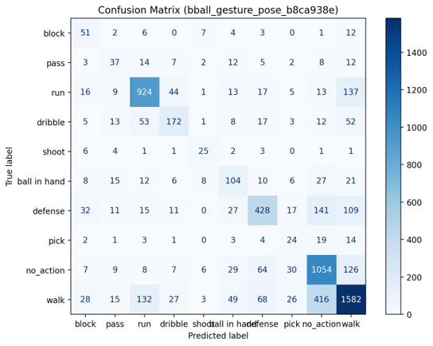

#### Ergebnisse Fold 5
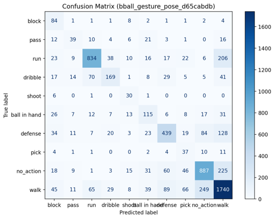

### Durchschnittliche F1-Scores über alle Folds hinweg

Die folgende Tabelle zeigt die stabilen Ergebnisse über alle Folds hinweg, inklusive der Standardabweichung (+/-):

| Klasse | F1-Score | +/- |
| :--- | :---: | :---: |
| **Block** | 45,9% | 2,8% |
| **Pass** | 35,0% | 3,7% |
| **Run** | 77,7% | 0,8% |
| **Dribble** | 53,7% | 1,7% |
| **Shoot** | 49,2% | 3,1% |
| **Ball in hand** | 46,5% | 1,4% |
| **Defense** | 61,9% | 0,9% |
| **Pick** | 26,6% | 1,0% |
| **No Action** | 70,1% | 0,7% |
| **Walk** | 72,4% | 0,8% |
| | | |
| **Macro Avg** | 53,9% | 0,7% |
| **Weighted Avg** | 68,1% | 0,3% |

 

## Verwendetes Modell: ST-GCN

Das Herzstück der Klassifizierung ist ein **Spatial Temporal Graph Convolutional Network (ST-GCN)**.

https://doi.org/10.48550/arXiv.1801.07455

[Yan, S., Xiong, Y., Lin, D.: Spatial Temporal Graph Convolutional Networks for Skeleton-Based Action Recognition. arXiv preprint arXiv:1801.07455 (2018)]

Dieses Modell ist speziell darauf ausgelegt, die natürlichen Verbindungen des menschlichen Körpers als Graphen zu verstehen und Bewegungen über die Zeit zu analysieren.

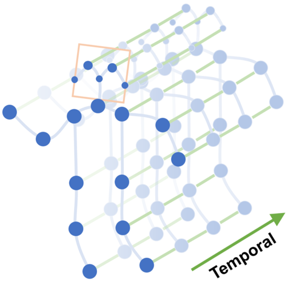

### Architektur-Komponenten

*   **Graph Convolution (Räumlich):**
    *   Nutzt die Skelett-Struktur des Körpers.
    *   Aggregiert Daten verbundener Gelenke (z. B. Informationstransfer von Hand zu Ellbogen).
    *   Durch die Übergabe einer **Kantenmatrix** (Adjazenzmatrix) "weiß" das Modell explizit, welche Gelenke anatomisch miteinander verbunden sind.
*   **Temporal Convolution (Zeitlich):**
    *   Scannt die Sequenz (z. B. 16 Frames) nach spezifischen Bewegungsmustern.
    *   Erkennt die Dynamik und Geschwindigkeit über die Zeitachse.
*   **STGCN-Block:** Kombiniert die räumliche und zeitliche Analyse in einer Einheit.
*   **Residual Links:** Unterstützen den Trainingsfluss und verhindern Datenverlust in tieferen Schichten des Netzwerks.

### Klassifizierung

*   **Global Pooling:** Verdichtet die extrahierten Informationen auf die wichtigsten Merkmale der gesamten Sequenz.
*   **Softmax:** Berechnet die finale Wahrscheinlichkeitsverteilung für die 10 definierten Action-Labels.

 

### Vergleich des ST-GCN Modells mit anderen Baseline Modellen
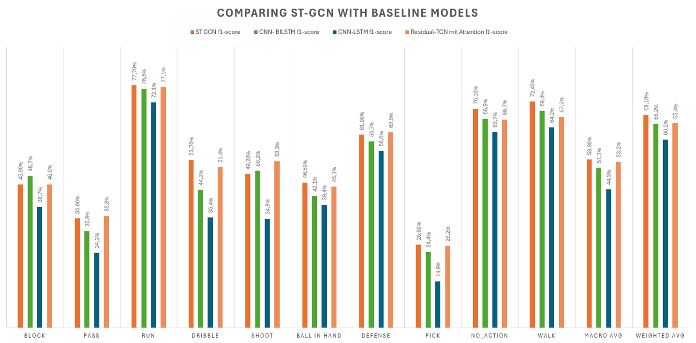
Um die Leistungsfähigkeit des **ST-GCN** einzuordnen, wurde es mit verschiedenen Standard-Architekturen der Video-Klassifizierung verglichen (CNN-BiLSTM, CNN-LSTM und Residual-TCN mit Attention):

*   **Überlegene Performance:** Das ST-GCN Modell erzielt in fast allen Kategorien den höchsten F1-Score, insbesondere bei komplexen Bewegungsabläufen wie **Dribble** (53,70%) und **Pass** (35,00%).
*   **Stabilität:** Mit einem **Weighted Avg von 68,10%** übertrifft das ST-GCN die zweitbeste Architektur (Residual-TCN) deutlich und zeigt eine robustere Generalisierung über alle 10 Klassen hinweg.
*   **Effizienz der Graphen-Struktur:** Der Vergleich zeigt deutlich, dass die explizite Modellierung der Skelett-Struktur (Graph) gegenüber rein sequentiellen Modellen (LSTM/TCN) einen signifikanten Vorteil bei der Erkennung menschlicher Posen bietet.

### 📚 Verwendeter Datensatz - Space Jam

Das Projekt nutzt den **Space Jam Datensatz**, welcher in der folgenden Forschungsarbeit von Simone Francia eingeführt wurde:

> Francia, S.: *Classificazione di Azioni Cestistiche mediante Tecniche di Deep Learning*. Ph.D. thesis (2018).  
> [**Volltext auf ResearchGate lesen**](https://www.researchgate.net/profile/Simone-Francia/publication/330534530_Classificazione_di_Azioni_Cestistiche_mediante_Tecniche_di_Deep_Learning/links/5c46d513a6fdccd6b5bf2a27/Classificazione-di-Azioni-Cestistiche-mediante-Tecniche-di-Deep-Learning.pdf)

#### Überblick der Gesten / Labels die im Datensatz enthalten sind

| ID | Aktion | Visualisierung                         | Merkmale und Beschreibung |
| :--- | :--- |:---------------------------------------| :--- |
| **0** | **Block** | 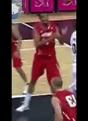               | Der Spieler blockt oder versucht, den Ball nach dem Wurf des Gegners abzufangen. |
| **1** | **Passing** | 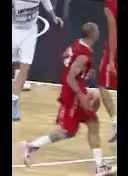                 | Der Spieler passt den Ball oder übergibt ihn an einen Mitspieler desselben Teams. |
| **2** | **Run** | 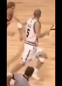                   | Der Spieler rennt, ohne eine andere Aktion auszuführen. Eingeschlossen sind schnelles Gehen und Sprünge. |
| **3** | **Dribble** | 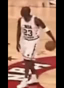           | Der Spieler prellt den Ball mindestens einmal auf den Boden und nimmt ihn wieder auf. |
| **4** | **Shoot** | 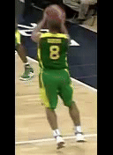               | Der Spieler wirft mit dem Ziel, den Ball in den Korb zu befördern. |
| **5** | **Ball in Hand** | 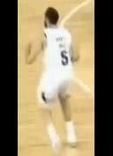 | Halten des Balls ohne Wurf/Pass. Kleine Fußbewegungen (Sternschritt) sind erlaubt. |
| **6** | **Defense** | 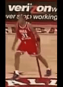           | Tiefgebeugte Verteidigungsposition (Manndeckung), sowohl in Bewegung als auch im Stand. |
| **7** | **Pick** | 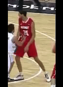                 | Der Spieler ohne Ball stellt einen Block für einen Mitspieler oder provoziert ein Offensivfoul. |
| **8** | **No Action** | 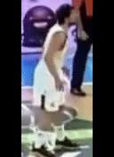       | Keine spezifische basketballrelevante Aktion im Sinne dieser Untersuchung. |
| **9** | **Walk** | 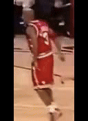                 | Der Spieler geht (mind. ein deutlicher Schritt). Schnelles Gehen ist in ID 2 enthalten. |

 

##### Infos über Verteilung der Klassen

| ID | Label Name | Anzahl Samples | Dauer (H:MM) | Anteil |
| :--- | :--- | :--- | :--- | :--- |
| 9 | **Walk** | 11.749 | **5h 13min** | 31,68 % |
| 8 | **No Action** | 6.490 | **2h 53min** | 17,50 % |
| 2 | **Run** | 5.924 | **2h 38min** | 15,97 % |
| 6 | **Defense** | 3.866 | **1h 43min** | 10,42 % |
| 3 | **Dribble** | 3.490 | **1h 33min** | 9,41 % |
| 5 | **Ball in hand** | 2.362 | **1h 03min** | 6,37 % |
| 1 | **Pass** | 1.070 | **0h 28min** | 2,89 % |
| 0 | **Block** | 996 | **0h 26min** | 2,69 % |
| 7 | **Pick** | 712 | **0h 19min** | 1,92 % |
| 4 | **Shoot** | 426 | **0h 11min** | 1,15 % |
| --- | --- | --- | --- | --- |
| **Σ** | **Gesamt** | **37.085** | **16h 29min** | **100 %** |

 

#### Modell für die Pose Estimation und Bounding Box Detection
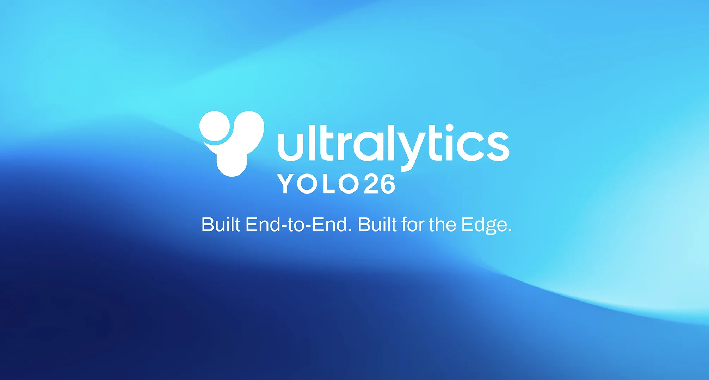

https://docs.ultralytics.com/tasks/pose

Für die Extraktion der Skelett-Daten nutzt das System folgende Konfiguration:

*   **YOLO26x mit Pose Estimation**
*   **Modell liefert 2D Koordinaten von 17 Keypoints:**
    *   Liefert Keypoints aller erkannten Personen (als Array)
    *   Basiert auf dem **COCO**-Format
*   **Die Kopf-Joints werden entfernt:**
    *   Reduktion auf **12 Keypoints** insgesamt (Fokus auf körperrelevante Bewegungen)

 

#### Keypoint Dataset Erstellen
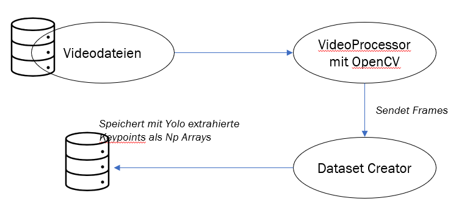

#### Normalisierung
Die Standard-Normalisierung von YOLO stößt bei variablen Videodaten an ihre Grenzen:

*   **YOLO liefert X,Y normalisierte Koordinaten:**
    *   Diese sind standardmäßig nach Bildbreite und Bildhöhe normalisiert.
*   **Warum dies problematisch ist:**
    *   Videos können unterschiedliche Auflösungen und Seitenverhältnisse haben.
    *   Spieler variieren in ihrer physischen Größe.
    *   Die Distanz zur Kamera (Perspektive) verändert die absolute Position der Keypoints.
*   **Lösung: Normalisierung zur Bounding Box**
    *   Um Invarianz gegenüber Skalierung und Position zu erreichen, werden die Keypoints relativ zur jeweiligen Bounding Box des Spielers normalisiert.

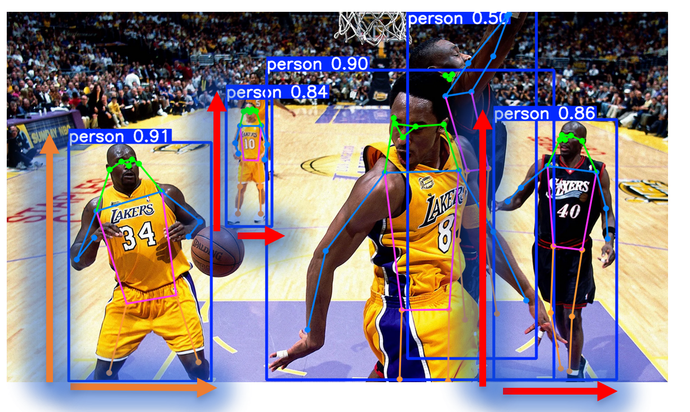

 

### Daten-Augmentierung (Skelett-Ebene)

Um die Robustheit des Modells gegenüber verschiedenen Kameraperspektiven und Zeitabläufen zu erhöhen, werden folgende Augmentierungen auf die Keypoint-Sequenzen angewendet:

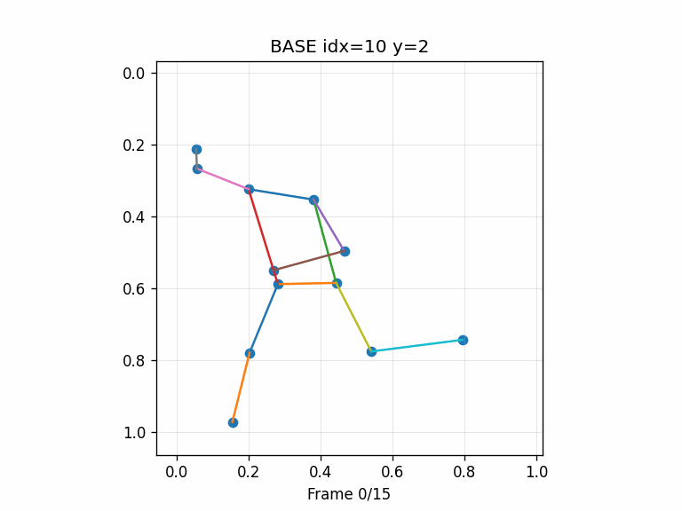

<em><strong>Base Skeleton:</strong> Die ursprüngliche, unveränderte Sequenz aus dem Datensatz.</em>

 

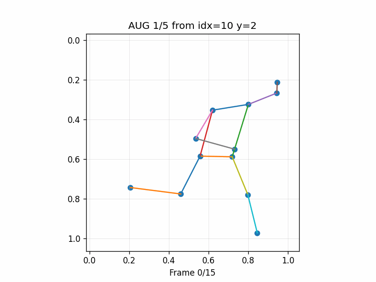

<em><strong>Horizontal Flip (Spiegelung):</strong> Tauscht linke und rechte Keypoints aus (<code>switch_left_and_right_window</code>). Dies simuliert eine gespiegelte Kameraperspektive und hilft dem Modell, Aktionen unabhängig von der Händigkeit des Spielers zu erkennen.</em>

 

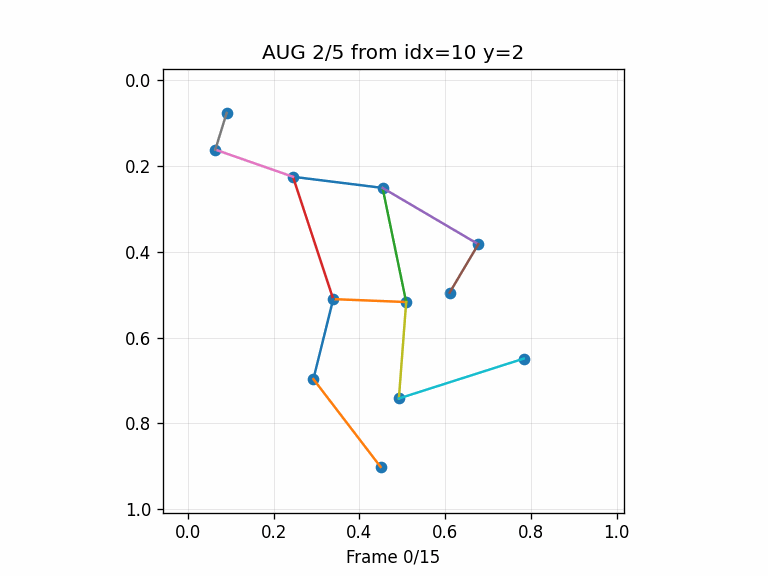

<em><strong>Random Time Shift:</strong> Verschiebt die Sequenz innerhalb des Zeitfensters (<code>random_time_shift_pad</code>). Durch das Auffüllen mit Padding-Werten lernt das Modell, dass Aktionen zu unterschiedlichen Zeitpunkten innerhalb eines Beobachtungsfensters starten können.</em>

 

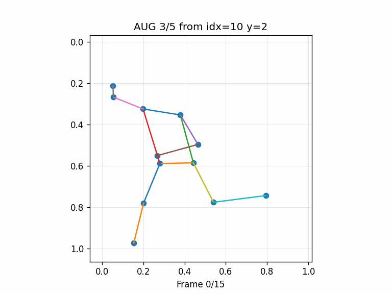

<em><strong>Time Stretch & Squeeze:</strong> Verändert die Geschwindigkeit der Bewegung durch Interpolation (<code>stretch_squeeze_interp_then_pad_crop</code>). Dies bildet die natürliche Varianz ab, mit der verschiedene Spieler dieselbe Aktion schneller oder langsamer ausführen.</em>

 

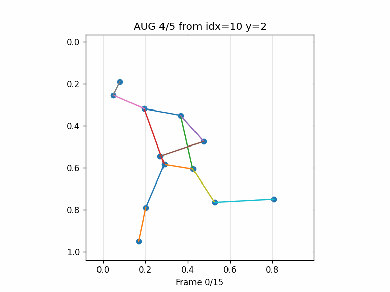

<em><strong>Gaussian Jitter:</strong> Fügt den Koordinaten ein leichtes Gaußsches Rauschen hinzu (<code>jitter_pose_noise</code>). Dies simuliert Ungenauigkeiten und "Zittern" der Keypoint-Erkennung durch den Pose-Estimator (YOLO).</em>

 

<em><strong>Kombinierte Augmentierung:</strong> Eine Kombination aus Spiegelung und zeitlicher Skalierung. Dies erzeugt hochkomplexe Trainingsbeispiele, die die Generalisierungsfähigkeit des Modells signifikant steigern.</em>

